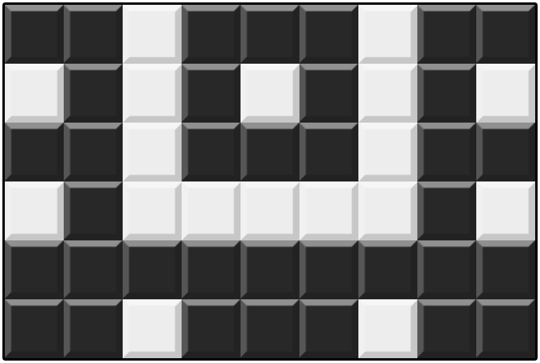
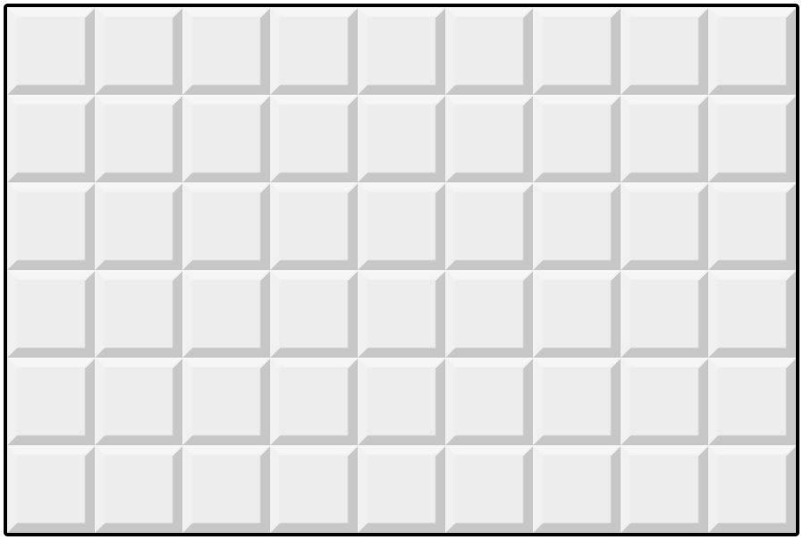
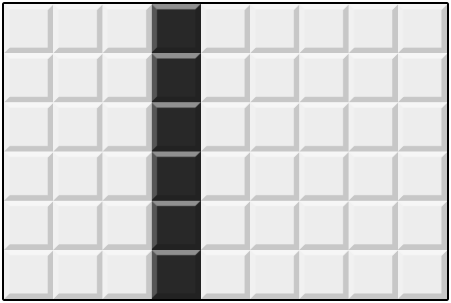
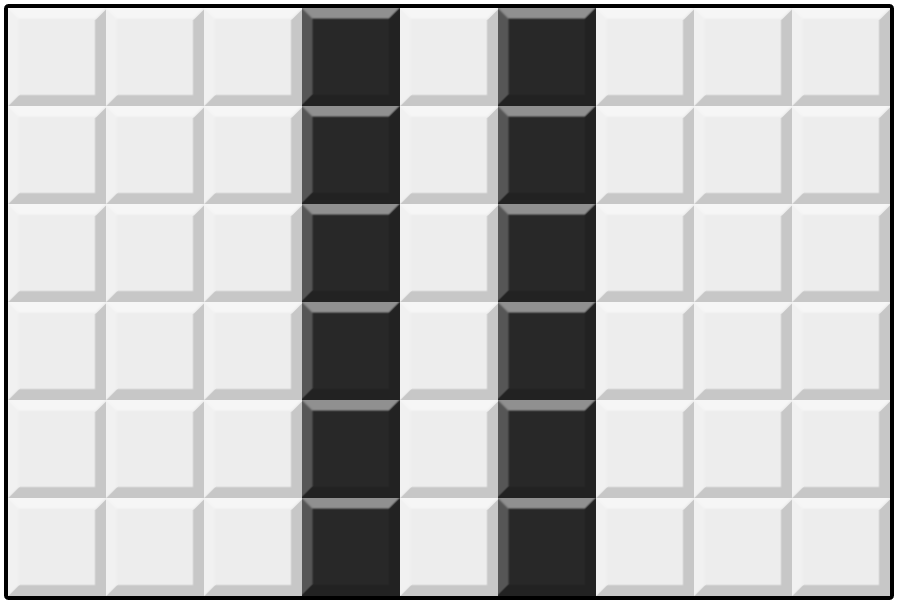
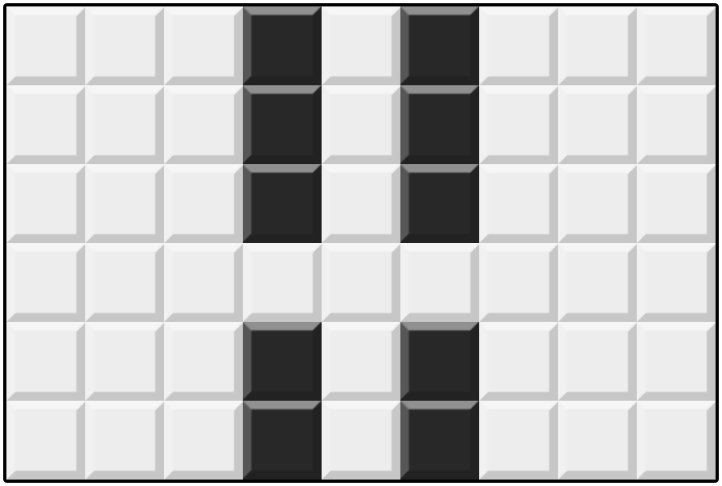
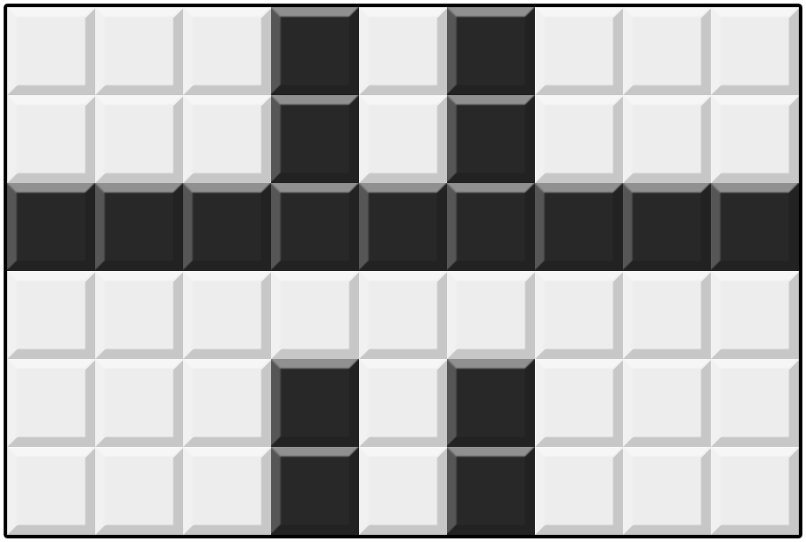
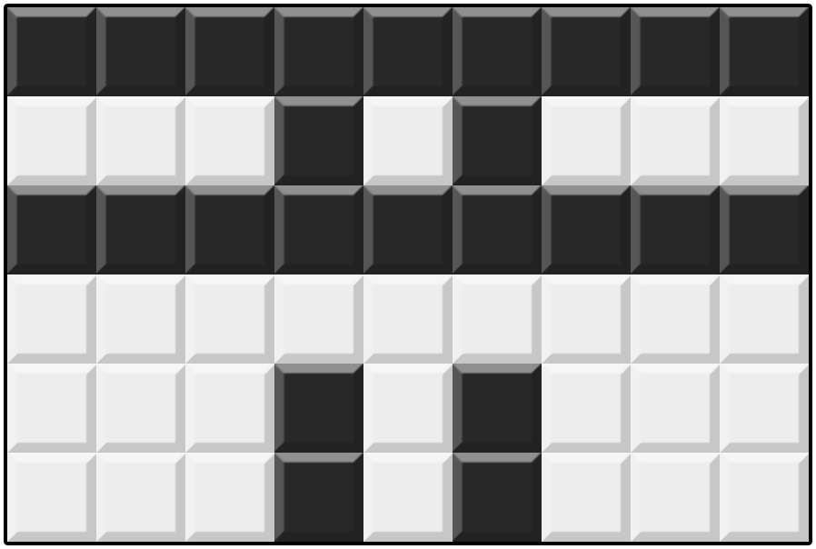
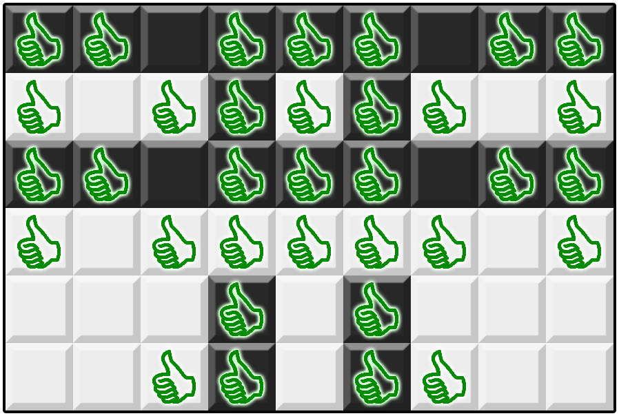

# Mosaik Monokrom

## Deskripsi

Bu Dengklek memiliki sebuah mosaik berbentuk grid N×M yang tiap petaknya bisa berwarna putih atau hitam. Baris-barisnya dinomori dari 1 hingga N dari atas ke bawah; kolom-kolomnya dinomori dari 1 hingga M dari kiri ke kanan. Kita notasikan (i, j) sebagai petak pada baris *i* dan kolom *j*. Pada awalnya, semua petak berwarna putih.

Dalam satu operasi, Bu Dengklek bisa melakukan salah satu aksi berikut:
- Memilih satu baris, lalu mewarnai semua petak di baris tersebut dengan satu warna sama.
- Memilih satu kolom, lalu mewarnai semua petak di kolom tersebut dengan satu warna sama.

Bu Dengklek memiliki rencana mosaik yang direpresentasikan dengan matriks S berukuran N×M yang setiap elemennya berupa karakter `.` atau `#`.

- Jika karakter S<sub>i,j</sub> adalah `.` maka Bu Dengklek ingin petak (i, j) berwarna putih pada akhirnya.
- Jika karakter S<sub>i,j</sub> adalah `#` maka Bu Dengklek ingin petak (i, j) berwarna hitam pada akhirnya.

Dijamin bahwa rencana mosaik Bu Dengklek pasti bisa dibentuk hanya dengan operasi-operasi di atas.

Bu Dengklek ingin melakukan tak lebih dari 200 000 operasi untuk menghasilkan mosaik yang semirip mungkin dengan rencana. Bantulah Bu Dengklek untuk mencari urutan operasi yang memaksimalkan banyaknya petak yang warnanya sesuai rencana!

## Batasan
- 1 ≤ N, M ≤ 100000  
- N×M ≤ 2000000  
- S hanya berisi karakter `.` atau `#`.  
- Dijamin bahwa rencana mosaik pasti bisa dibentuk hanya dengan operasi-operasi di atas.

## Informasi Tipe Soal
Soal ini bertipe "output-only". Untuk setiap kasus uji, Anda mencetak keluaran program ke dalam sebuah berkas keluaran.

Masukan untuk soal ini dapat diunduh di bagian lampiran yang terdapat di bagian bawah soal. Di dalam berkas .zip tersebut terdapat 5 masukan untuk diselesaikan: `mosaik_1.in`, `mosaik_2.in`, `mosaik_3.in`, `mosaik_4.in`, dan `mosaik_5.in`.

Untuk setiap berkas masukan yang diselesaikan (Anda tidak harus menyelesaikan semua masukan), buatlah berkas keluaran dengan nama `mosaik_T.out`, dengan T adalah nomor kasus uji. Kemudian, kompres semua berkas keluaran ke dalam sebuah berkas `.zip`, lalu kumpulkan.

## Masukan
Masukan diberikan dalam format berikut:
```text
N M
S1,1S1,2…S1,N
S2,1S2,2…S2,M
⋮ ⋱ ⋮
SN,1SN,2…SN,M
```


## Keluaran
Pada baris pertama, keluarkan sebuah bilangan bulat Z (0 ≤ Z ≤ 200000) yang menyatakan banyaknya operasi yang dilakukan.

Kemudian, keluarkan Z baris, dengan baris ke-k menyatakan operasi ke-k. Setiap baris berisi tiga bagian yang dipisahkan oleh spasi:
1. Sebuah string `BARIS` atau `KOLOM` yang menyatakan apakah operasinya dilakukan pada baris atau kolom.
2. Sebuah bilangan bulat yang menyatakan nomor baris/kolom yang dilakukan operasi.
3. Sebuah karakter `.` atau `#` yang menyatakan warna operasi, dengan `.` menyatakan putih dan `#` menyatakan hitam.

## Penilaian
Keluaran Anda akan mendapatkan nilai pada sebuah kasus uji jika keluaran Anda mengikuti format keluaran dan memenuhi batasan.

Untuk suatu kasus uji, setelah semua operasi dilakukan, jika c adalah banyaknya petak yang warnanya sesuai dengan rencana, nilai Anda untuk kasus uji itu adalah $(\frac{c}{N \times M})^3 \times 20$. Nilai akhir adalah jumlah nilai semua kasus uji, yang kemudian dibulatkan ke bawah.

Jika suatu kasus uji mendapatkan nilai, Anda bisa melihat penilaiannya secara detail di halaman pengumpulan. Anda bisa melihat banyaknya petak yang sesuai rencana untuk kasus uji tersebut.

## Contoh Masukan
```text
6 9
##.###.##
.#.#.#.#.
##.###.##
.#.....#.
#########
##.###.##
```

## Contoh Keluaran
```text
5
KOLOM 4 #
KOLOM 6 #
BARIS 4 .
BARIS 3 #
BARIS 1 #
```

## Penjelasan Contoh
Berikut adalah rencana mosaik Bu Dengklek.


Urutan operasi di atas akan mengubah mosaiknya seperti berikut.






Berikut adalah posisi petak-petak yang sesuai rencana.

Oleh karena itu, nilai untuk kasus uji ini adalah $(\frac{34}{6 \times 9})^3 \times 20 \approx 4.992$.

## Lampiran
Berkas masukan untuk soal ini dapat diunduh [di sini](https://api.tlx.toki.id/api/v2/problems/JIDPROGbDLh6vwDRHTXFijN3HYC/render/inputs.zip).